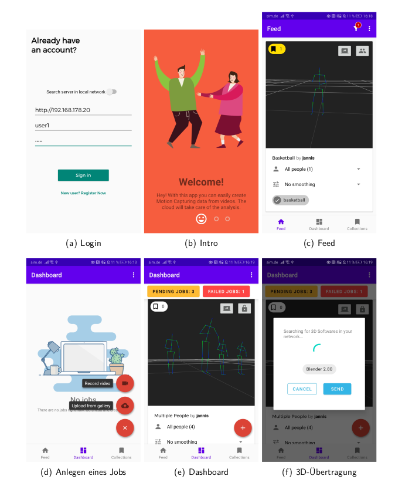

# Motion Capturing API from Single RGB Videos
This is an API which is using xnect to
calculate dynamic pose data. Input data is a rgb video. It can process
multiple people.
## License
The XNECT-Files are not included in this repository, because their license forbids it.
You have to manually request them from [their page](https://gvv.mpi-inf.mpg.de/projects/XNect/).
## About the app
The app is available in my other repository, [multipose-service-app](https://github.com/Sinnaj94/multipose-service-app).
### Screenshots
The Android App in Action looks like this:

## Hardware
You need a graphics card with CUDA-Support for the calculations.
## Requisites
This repository has been fully tested on [Ubuntu 20.04](https://releases.ubuntu.com/20.04/).
It might also work on other Environments, but you may need different installation steps to make it run.
### Request XNECT download
:warning: XNECT's license doesn't permit commercial usage:
```
Permission is hereby granted, free of charge, to any person or company obtaining a copy of this software and associated documentation files (the "Software") from the copyright holders to use the Software for any non-commercial purpose. Publication, redistribution and (re)selling of the software, of modifications, extensions, and derivates of it, and of other software containing portions of the licensed Software, are not permitted. The Copyright holder is permitted to publically disclose and advertise the use of the software by any licensee.

Packaging or distributing parts or whole of the provided software (including code, models and data) as is or as part of other software is prohibited. Commercial use of parts or whole of the provided software (including code, models and data) is strictly prohibited. Using the provided software for promotion of a commercial entity or product, or in any other manner which directly or indirectly results in commercial gains is strictly prohibited.

THE SOFTWARE IS PROVIDED "AS IS", WITHOUT WARRANTY OF ANY KIND, EXPRESS OR IMPLIED, INCLUDING BUT NOT LIMITED TO THE WARRANTIES OF MERCHANTABILITY, FITNESS FOR A PARTICULAR PURPOSE AND NONINFRINGEMENT. IN NO EVENT SHALL THE AUTHORS OR COPYRIGHT HOLDERS BE LIABLE FOR ANY CLAIM, DAMAGES OR OTHER LIABILITY, WHETHER IN AN ACTION OF CONTRACT, TORT OR OTHERWISE, ARISING FROM, OUT OF OR IN CONNECTION WITH THE SOFTWARE OR THE USE OR OTHER DEALINGS IN THE SOFTWARE.
```
However, in this repository the source code is automatically built. For that, please put the downloaded XNECT-Source code into ```services/xnect/xnect_library```.

Please refrain from using the Software commercially, if you use XNECT or create a fork and use another multiperson-Framework.
### Installing the NVIDIA driver
First of all, you should install an NVIDIA driver with support for CUDA >10.0.
It is recommended to get the newest driver from the [NVIDIA site](https://www.nvidia.de/Download/index.aspx) and install it.
In Ubuntu, you can install the driver using *Software Update*, but this didn't work for me.
You don't need to install the CUDA toolkit yet, the Docker Image will take care of that
([more info on this page](https://github.com/NVIDIA/nvidia-docker)).
### Installing docker
This image is heavily relying on the benefits of the software [Docker](https://www.docker.com/).
You must install it on your local machine. 
#### docker-compose Extension
Unfortunately, you have to do an easy manual extension of the *docker-compose*-ecosystem.
This step is very important, because otherwise, the `docker-compose` commands will not be available for this repository.

It is a [widely known issue](https://github.com/docker/compose/issues/6691), that the NVIDIA toolkit is not integrated into `docker-compose` files yet.
Follow the steps of *Installation* from the repository https://github.com/NVIDIA/nvidia-container-runtime to make it work.
### Downloading the 3D models
The *openpose* images come with docker, so you don't have to take care of that.
Nonetheless, you have to download the right models for 3d evaluation and put them into the [3d_models](services/web/3d_models) folder.

The models are not mine, they are from the following repository: https://github.com/KevinLTT/video2bvh.
They can be downloaded from [Google Drive](https://drive.google.com/drive/folders/1M2s32xQkrDhDLz-VqzvocMuoaSGR1MfX).

You only have to download the `openpose_video_pose_243f` folder and extract the files `best_58.58.pth` and `video_pose.yaml`
directly into the [services/web/3d_models](services/web/3d_models) folder.
## Configuration
### Security
:warning: If you are planning on running this app on production, it is important to change the keys
to *secure strings*.
#### PostgreSQL
From [docker-compose.yml](docker-compose.yml):
```
environment:
      - POSTGRES_USER=user
      - POSTGRES_PASSWORD=CHANGE_THIS_TO_A_STRONG_PASSWORD
      - POSTGRES_DB=mocap
```
From [.env.dev](.env.dev):
```
DATABASE_URL=postgresql://user:CHANGE_THIS_TO_A_STRONG_PASSWORD@db:5432/mocap
```
#### Flask
From [.env.dev](.env.dev): 
```
SECRET_KEY=CHANGE_THIS_KEY
```
### App Settings
The Server Settings can be accessed in file [services/web/project/config.py](services/web/project/config.py).
The Reverse Proxy can be configured using file [services/nginx/nginx.conf](services/nginx/nginx.conf)
## Running
Running this project is fairly easy. You just have to type `docker-compose build` to build the image and `docker-compose up`
to run the application. Docker will take care of creating and managing the containers and installing all the requirements.
If an error occurs, it is probably due to a wrong NVIDIA-CUDA-Docker configuration.
Please refer to [docker-compose Extension](#docker-compose-Extension) to fix that error.
The debugged Server can be accessed via `localhost:80`
### Debug Mode
If you want to run the project in debug mode you have to type `docker-compose -f docker-compose-dev.yml`.
The flask server can be accessed via `localhost:5000`
## Working with the api
If everything works, your API will be accessible at [127.0.0.1 (localhost)](127.0.0.1).
All methods are descripted using a swagger documentation.

The Methods are also listed in the wiki.
## References
- [video2bvh](https://github.com/KevinLTT/video2bvh) by KevinLTT - MIT License
- [BVHSmooth](https://github.com/vdbalbom/BVHsmooth) by Virgínia Balbo - MIT License
- [XNECT](https://gvv.mpi-inf.mpg.de/projects/XNect/) by Mehta et al. (Source files not included in this repository) - ONLY FOR NON-COMMERCIAL PURPOSES
